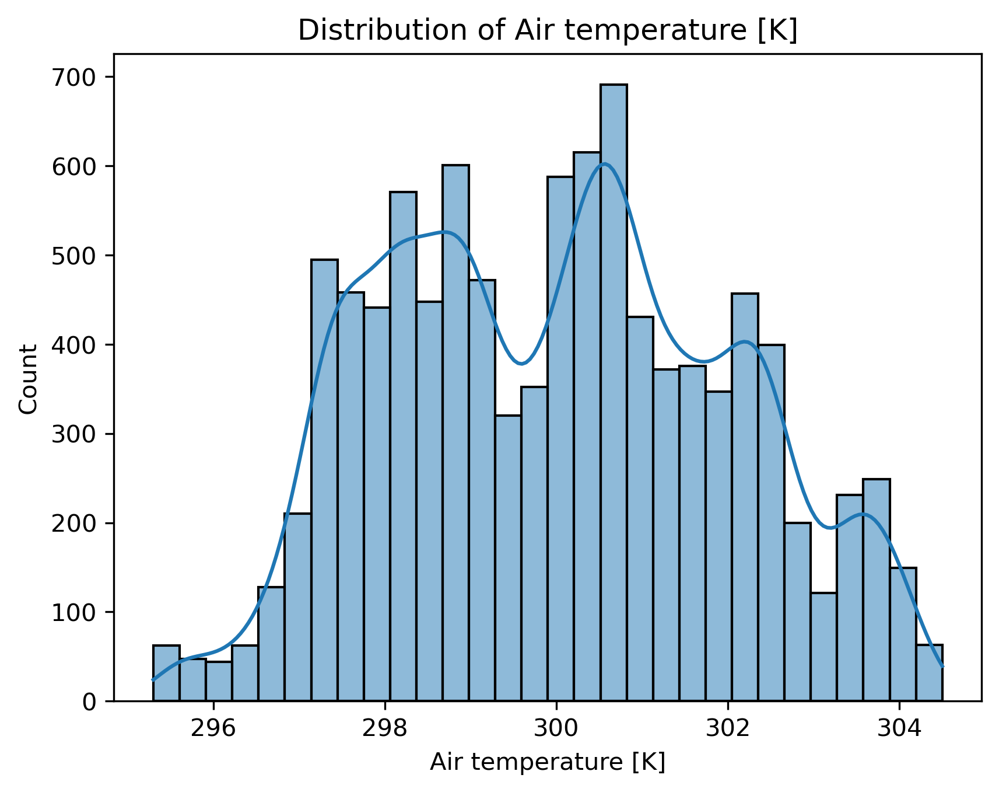
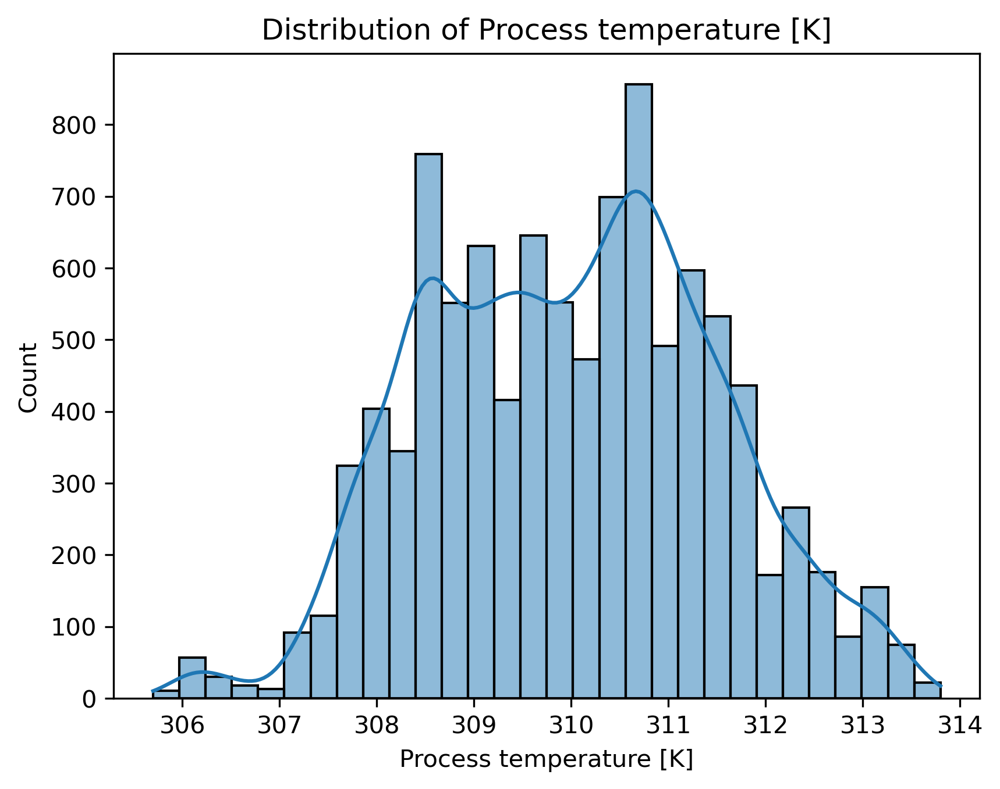
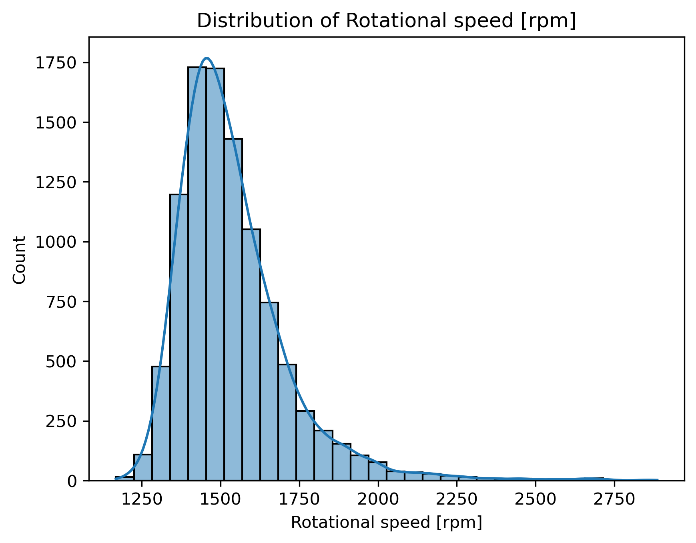
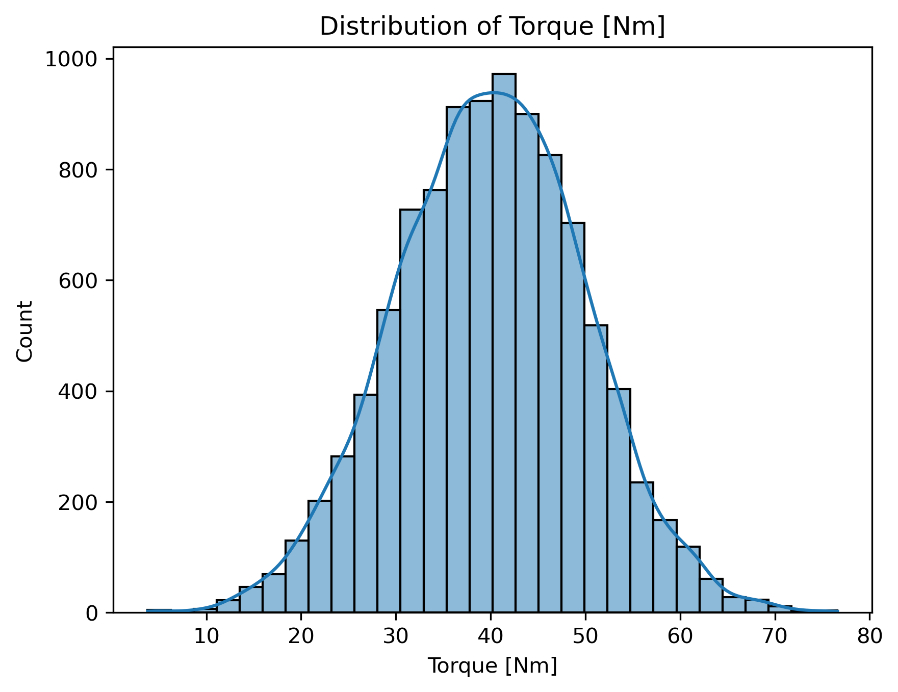

# Predictive Maintenance
Machine learning pipeline for predictive maintenance - forecasting equipment failures from sensor and operational data to enable proactive servicing.

## Project Overview
This project focuses on predicting machine failures using machine learning techniques.

The dataset contains information about different machine operating conditions, including air temperature, process temperature, rotational speed, torque, and tool wear.

The goal of the project is to analyze the relationships between machine parameters and failures, preprocess the data, select relevant features, and develop a machine learning model capable of predicting machine failures.

## Dataset
| Feature | Description |
|---|---|
| UDI | Unique identifier |
| Product ID | Product identifier |
| Type | Type of product |
| Air temperature [K] | Air temperature |
| Process temperature [K] | Process temperature |
| Rotational speed [rpm] | Rotational speed |
| Torque [Nm] | Torque |
| Tool wear [min] | Tool wear |
| Target | Machine failure indicator |

## Exploratory Data Analysis

Exploratory Data Analysis (EDA) was performed to better understand the structure and distribution of the dataset.

The analysis included:

- Checking for missing values
- Inspecting data types
- Analyzing numerical feature distributions
- Detecting potential outliers using boxplots
- Comparing numerical features between machine failure and non-failure cases
- Investigating relationships between features and the target variable
### Feature distributions

## Data Preprocessing

The following preprocessing steps were performed:

- Removed identifier columns that do not provide useful predictive information.
- Checked for missing values.
- Separated features from the target variable.
- Split the dataset into training and testing sets.
- Standardized numerical features where required.

## Model Development

Several machine learning models were evaluated for the classification task:

- Logistic Regression
- K-Nearest Neighbors
- Decision Tree
- Random Forest

## Model Evaluation

The models were evaluated using several classification metrics:

- Accuracy
- Precision
- Recall
- F1-score
- Confusion Matrix

## Results

The Random Forest model achieved the best overall performance among the evaluated models.

The results indicate that machine operating conditions such as torque, rotational speed, and tool wear contain useful information for predicting machine failures.

The final model was selected based on its performance across multiple evaluation metrics rather than accuracy alone.

## Technologies

- Python
- NumPy
- Pandas
- Matplotlib
- Seaborn
- Scikit-learn
- Jupyter Notebook

## Conclusion

This project demonstrates a complete machine learning workflow for predicting machine failures, from exploratory data analysis and preprocessing to feature selection, model training, hyperparameter optimization, and evaluation.

The analysis shows how machine operating conditions can be used to identify patterns associated with machine failures.
